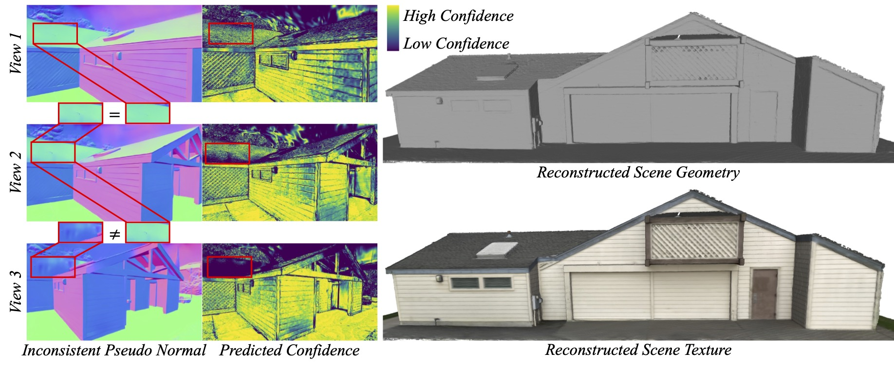

<p align="center">

  <h1 align="center">VCR-GauS: View Consistent Depth-Normal Regularizer for Gaussian Surface Reconstruction</h1>
  <p align="center">
    <a href="https://hlinchen.github.io/">Hanlin Chen</a>,
    <a href="https://weify627.github.io/">Fangyin Wei</a>,
    <a href="https://chaneyddtt.github.io/">Chen Li</a>,
    <a href="https://tianxinhuang.github.io/">Tianxin Huang</a>,
    <a href="https://scholar.google.com/citations?user=vv1uLeUAAAAJ&hl=en">Yunsong Wang</a>,
    <a href="https://www.comp.nus.edu.sg/~leegh/">Gim Hee Lee</a>

  </p>

  <h2 align="center">NeurIPS 2024</h2>

  <h3 align="center"><a href="https://arxiv.org/pdf/2406.05774">arXiv</a> | <a href="https://hlinchen.github.io/projects/VCR-GauS/">Project Page</a>  </h3>
  <div align="center"></div>
</p>


<p align="center">
  <a href="">
    
  </a>
</p>

<p align="left">
VCR-GauS formulates a novel multi-view D-Normal regularizer that enables full optimization of the Gaussian geometric parameters to achieve better surface reconstruction. We further design a confidence term to weigh our D-Normal regularizer to mitigate inconsistencies of normal predictions across multiple views.</p>
<br>

# Updates

* **[2024.09.24]**: VCR-GauS is accepted to NeurIPS 2024.

# Installation
Clone the repository and create an anaconda environment using
```
git clone https://github.com/HLinChen/VCR-GauS.git --recursive
cd VCR-GauS
git pull --recurse-submodules

env=vcr
conda create -n $env -y python=3.10
conda activate $env
pip install -e ".[train]"
# you can specify your own cuda path
export CUDA_HOME=/usr/local/cuda-11.8
pip install -r requirements.txt
```

For eval TNT with the official scripts, you need to build a new environment with open3d==0.10:
```
env=f1eval
conda create -n $env -y python=3.8
conda activate $env
pip install -e ".[f1eval]"
```

For extract normal maps based on [DSINE](https://baegwangbin.github.io/DSINE/), you need to build a new environment:
```
conda create --name dsine python=3.10
conda activate dsine

conda install pytorch torchvision torchaudio pytorch-cuda=12.1 -c pytorch -c nvidia
python -m pip install geffnet
```


Similar to Gaussian Splatting, we also use colmap to process data and you can follow [COLMAP website](https://colmap.github.io/) to install it.


# Dataset

<!-- Please download the Mip-NeRF 360 dataset from the [official webiste](https://jonbarron.info/mipnerf360/), the preprocessed DTU dataset from [2DGS](https://surfsplatting.github.io/), the proprocessed Tanks and Temples dataset from [here](https://huggingface.co/datasets/ZehaoYu/gaussian-opacity-fields/tree/main). You need to download the ground truth point clouds from the [DTU dataset](https://roboimagedata.compute.dtu.dk/?page_id=36) and save to `dtu_eval/Offical_DTU_Dataset` to evaluate the geometry reconstruction. For the [Tanks and Temples](https://www.tanksandtemples.org/download/) dataset, you need to download the ground truth point clouds, alignments and cropfiles and save to `eval_tnt/TrainingSet`, such as `eval_tnt/TrainingSet/Caterpillar/Caterpillar.ply`. -->


## Tanks and Temples dataset
You can download the proprocessed Tanks and Temples dataset from [here](https://huggingface.co/Chiller3/VCR-GauS/resolve/main/tnt.zip?download=true). Or proprocess it by your self:
Download the data from [Tanks and Temples](https://tanksandtemples.org/download/) website.
You will also need to download additional [COLMAP/camera/alignment](https://drive.google.com/file/d/1jAr3IDvhVmmYeDWi0D_JfgiHcl70rzVE/view?resourcekey=) and the images of each scene.  
The file structure should look like (you need to move the downloaded images to folder `images_raw`):
```
tanks_and_temples
├─ Barn
│  ├─ Barn_COLMAP_SfM.log   (camera poses)
│  ├─ Barn.json             (cropfiles)
│  ├─ Barn.ply              (ground-truth point cloud)
│  ├─ Barn_trans.txt        (colmap-to-ground-truth transformation)
│  └─ images_raw            (raw input images downloaded from Tanks and Temples website)
│     ├─ 000001.png
│     ├─ 000002.png
│     ...
├─ Caterpillar
│  ├─ ...
...
```
#### 1. Colmap and bounding box json
Run the following command to generate json and colmap files:
```bash
# Modify --tnt_path to be the Tanks and Temples root directory.
sh bash_scripts/1_preprocess_tnt.sh
```

#### 2. Normal maps
You need to download the [code](https://github.com/baegwangbin/DSINE) and [model weight](https://drive.google.com/drive/folders/1t3LMJIIrSnCGwOEf53Cyg0lkSXd3M4Hm) of DSINE first. Then, modify **CODE_PATH** to be the DSINE root directory, **CKPT** to be the DSINE model path, **DATADIR** to be the TNT root directory in the bash script.
Run the following command to generate normal maps:

```bash
sh bash_scripts/2_extract_normal_dsine.sh
```

#### 3. Semantic masks (optional)

If you don't want to use the semantic masks, you can set **optim.loss_weight.semantic=0** and skip the mask generation.

You need to download the [code](https://github.com/IDEA-Research/Grounded-Segment-Anything) and model of Grounded-SAM first. Then, install the environment based on 'Install without Docker' in the [webside](https://github.com/IDEA-Research/Grounded-Segment-Anything). Next, modify **GSAM_PATH** to be the GSAM root directory, **DATADIR** to be the TNT root directory in the bash script. Run the following command to generate semantic masks:

```bash
sh bash_scripts/3_extract_mask.sh
```

## Other datasets
Please download the Mip-NeRF 360 dataset from the official [webiste](https://jonbarron.info/mipnerf360/), the preprocessed DTU dataset from [2DGS](https://drive.google.com/drive/folders/1SJFgt8qhQomHX55Q4xSvYE2C6-8tFll9). And extract normal maps with DSINE following the above scripts. You can also use [GeoWizard](https://github.com/fuxiao0719/GeoWizard) to extract normal maps by following the script: 'bash_scripts/4_extract_normal_geow.sh', and please install the corresponding environment and download the code as well as model weights first.

# Training and Evaluation
## From the scratch:
```
# you might need to update the data path in the script accordingly

# Tanks and Temples dataset
python python_scripts/run_tnt.py

# Mip-NeRF 360 dataset
python python_scripts/run_mipnerf360.py
```

## Only eval the metrics
We have uploaded the extracted meshes, you can download and eval them by yourselves ([TNT](https://huggingface.co/Chiller3/VCR-GauS/resolve/main/tnt_mesh.zip?download=true) and [DTU](https://huggingface.co/Chiller3/VCR-GauS/resolve/main/dtu_mesh.zip?download=true)). You might need to update the **mesh and data path** in the script accordingly. And set **do_train** and **do_extract_mesh** to be False.

```
# Tanks and Temples dataset
python python_scripts/run_tnt.py

# DTU dataset
python python_scripts/run_dtu.py
```

## Additional regularizations:
We also incorporate some regularizations, like depth distortion loss and normal consistency loss, following [2DGS](https://surfsplatting.github.io/) and [GOF](https://niujinshuchong.github.io/gaussian-opacity-fields/). You can play with it by:
- normal consistency loss: setting optim.loss_weight.consistent_normal > 0;
- depth distortion loss:
  1. set optim.loss_weight.depth_var > 0
  2. set NUM_DIST = 1 in submodules/diff-gaussian-rasterization/cuda_rasterizer/config.h, and reinstall diff-gaussian-rasterization


# Custom Dataset
We use the same data format from 3DGS, please follow [here](https://github.com/graphdeco-inria/gaussian-splatting?tab=readme-ov-file#processing-your-own-scenes) to prepare the your dataset. Then you can train your model and extract a mesh.
```
# Generate bounding box
python process_data/convert_data_to_json.py \
        --scene_type outdoor \
        --data_dir /your/data/path

# Extract normal maps
# Use DSINE:
python -W ignore process_data/extract_normal.py \
    --dsine_path /your/dsine/code/path \
    --ckpt /your/ckpt/path \
    --img_path /your/data/path/images \
    --intrins_path /your/data/path/ \
    --output_path /your/data/path/normals

# Or use GeoWizard
python process_data/extract_normal_geo.py \
  --code_path ${CODE_PATH} \
  --input_dir /your/data/path/images/ \
  --output_dir /your/data/path/ \
  --ensemble_size 3 \
  --denoise_steps 10 \
  --seed 0 \
  --domain ${DOMAIN_TYPE} # outdoor indoor object

# training
# --model.resolution=2 for using downsampled images with factor 2
# --model.use_decoupled_appearance=True to enable decoupled appearance modeling if your images has changing lighting conditions
python train.py \
  --config=configs/reconstruct.yaml \
  --logdir=/your/log/path/ \
  --model.source_path=/your/data/path/ \
  --model.data_device=cpu \
  --model.resolution=2 \
  --wandb \
  --wandb_name vcr-gaus"

# extract the mesh after training
python tools/depth2mesh.py \
  --voxel_size 5e-3 \
  --max_depth 8 \
  --clean \
  --cfg_path /your/gaussian/path/config.yaml"
```

# Acknowledgements
This project is built upon [3DGS](https://github.com/graphdeco-inria/gaussian-splatting). Evaluation scripts for DTU and Tanks and Temples dataset are taken from [DTUeval-python](https://github.com/jzhangbs/DTUeval-python) and [TanksAndTemples](https://github.com/isl-org/TanksAndTemples/tree/master/python_toolbox/evaluation) respectively. We also utilize the normal estimation [DSINE](https://github.com/baegwangbin/DSINE) as well as [GeoWizard](https://fuxiao0719.github.io/projects/geowizard/), and semantic segmentation [SAM](https://github.com/facebookresearch/segment-anything) and [Grounded-SAM](https://github.com/IDEA-Research/Grounded-Segment-Anything?tab=readme-ov-file#install-without-docker). In addition, we use the pruning method in [LightGaussin](https://lightgaussian.github.io/). We thank all the authors for their great work and repos. 


# Citation
If you find our code or paper useful, please cite
```bibtex
@article{chen2024vcr,
  author    = {Chen, Hanlin and Wei, Fangyin and Li, Chen and Huang, Tianxin and Wang, Yunsong and Lee, Gim Hee},
  title     = {VCR-GauS: View Consistent Depth-Normal Regularizer for Gaussian Surface Reconstruction},
  journal   = {arXiv preprint arXiv:2406.05774},
  year      = {2024},
}
```

If you the flatten 3D Gaussian useful, please kindly cite
```bibtex
@article{chen2023neusg,
  title={Neusg: Neural implicit surface reconstruction with 3d gaussian splatting guidance},
  author={Chen, Hanlin and Li, Chen and Lee, Gim Hee},
  journal={arXiv preprint arXiv:2312.00846},
  year={2023}
}
```